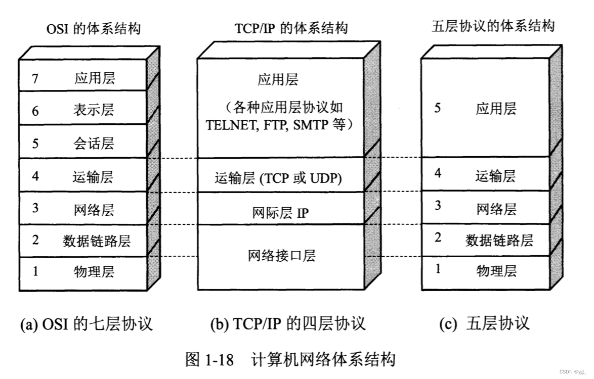

+ [网络协议：什么是网络分层的七四五](https://cloud.tencent.com/developer/article/2183899)

## 五层网络/七层网络

### 概述

网络协议分层有很多种，我们能接触到最常见的则是 3 种：
 1. **OSI 体系结构（七层）**
 2. **TCP/IP 体系结构（四层）**
 3. **五层体系结构**

**OSI 体系结构：** 是国际标准化组织（ISO）在1978 年提出的 “开放系统互联参考模型” 使用的结构，概念清楚，理论也比较完整，但是它 **既复杂又不实用**

**TCP/IP体系结构：** TCP/IP是一个 **四层** 体系结构，得到了 **广泛运用**

**五层体系结构：** 为了 **方便学习** ，折中 OSI 体系结构和 TCP/IP 体系结构，综合二者的优点，这样既 **简洁**，又能将概念讲清楚

### OSI 体系结构
为了 **增强通用性和兼容性**，计算机网络都被设计成层次机构，每一层都遵守一定的规则。因此有了OSI这样一个抽象的网络通信参考模型，按照这个标准使计算机网络系统可以互相连接。

7 层是指 OSI 七层协议模型，主要是：

+ **应用层**：最高层，面对用户，提供计算机网络与最终呈现给用户的界面
+ **表示层**：为了使得数据能够被其他的计算机理解，再次将数据转换成另外一种格式，比如文字、视频、图片等。
+ **会话层**：负责建立和断开连接
+ **传输层**：有了网络层的 MAC+IP 地址之后，为了确定数据包是从哪个进程发送过来的，就需要端口号，通过端口来建立通信。**TCP 和 UDP 属于传输层的协议**
+ **网络层**：广播的形式太低效，为了区分哪些 MAC 地址属于同一个子网，**网络层定义了 IP 和子网掩码**，通过对IP和子网掩码进行与运算就知道是否是同一个子网，再通过路由器和交换机进行传输。**IP协议属于网络层的协议**
+ **数据链路层**：首先，把比特流封装成数据帧的格式，对 0、1 进行分组。电脑连接起来之后，数据都经过网卡来传输，而网卡上定义了全世界唯一的 MAC 地址。然后再通过广播的形式向局域网内所有电脑发送数据，再根据数据中 MAC 地址和自身对比判断是否是发给自己的。
+ **物理层**：通过网线、光缆等这种物理方式将电脑连接起来。传递的数据是 **比特流** ，0101010100。

OSI 七层参考模型的各个层次的划分遵循下列原则：

1. 同一层中的各网络节点都有相同的层次结构，具有同样的功能。
2. 同一节点内相邻层之间通过接口(可以是逻辑接口)进行通信。
3. 七层结构中的每一层使用下一层提供的服务，并且向其上层提供服务。
4. 不同节点的同等层按照协议实现对等层之间的通信。

### TCP/IP体系结构
TCP/IP 即传输控制协议/网络互联协议，是针对 Internet 开发的一种体系结构和协议标准，相对于 OSI 体系结构更 **简洁**。
分层体系，由下至上分别是

+ **数据链路层**：也有称作网络访问层、网络接口层。他包含了 OSI 模型的物理层和数据链路层，把电脑连接起来。
+ **网络层**：也叫做 IP 层，处理 IP 数据包的传输、路由，建立主机间的通信。
+ **传输层**：传输层的主要工作是定义端口，标识应用程序身份，实现端口到端口的通信。
+ **应用层**：包含 OSI 的会话层、表示层和应用层，提供了一些常用的协议规范，比如 FTP、SMPT、HTTP 等。

> 总结下来，数据链路层就是通过物理手段把电脑连接起来并对比特流的数据进行分组，网络层来建立主机到主机的通信，传输层建立端口到端口的通信，应用层最终负责建立连接，数据格式转换，最终呈现给用户。

### 五层体系结构

五层体系结构只是 **OSI和TCP/IP的综合**，是 **业界产生** 出来的 **非官方协议模型**，主要是**用于方便理解的模型**，即很多具体的应用，**实际应用还是TCP/IP的四层结构**。为了方便可以把下两层称为网络接口层。
五层体系结构包括：

+ **应用层**：应用层是网络协议的最高层，主要任务通过进程间的交互完成特定网络应用。应用层协议定义的是应用程序（进程）间通信和交互的规则。 对于不同的网络应用需要有不同的应用层协议，在互联网中的应用层协议很多，如域名系统DNS，支持万维网应用的HTTP协议，支持电子邮件的SMTP协议，等等。应用层交互的数据单元称为报文。
+ **运输层**：有时也译为传输层，它负责为两台主机中的进程提供通信服务。
+ **网络层**：网络层负责为分组网络中的不同主机提供通信服务，并通过选择合适的路由将数据传递到目标主机。在发送数据时，网络层把运输层产生的报文段或用户数据封装成分组或 包进行传送。 在TCP/IP体系中，由于网络层使用IP协议，因此分组也叫IP数据报。
+ **数据链路层**：数据链路层通常简称为链路层。数据链路层在两个相邻节点传输数据时，将网络层交下来的IP数据报组装成帧，在两个相邻节点之间的链路上传送帧。
+ **物理层**：保数据可以在各种物理媒介上进行传输，为数据的传输提供可靠的环境。