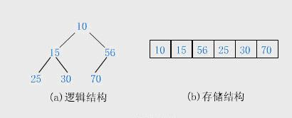

- [一文读懂堆与栈的区别](https://cloud.tencent.com/developer/article/1996554)

## 栈

### 栈 - 数据结构

栈是一种仅允许在栈顶端进行插入、删除操作的线性表，另一端称为栈底。 **<u>先进后出</u>**

**入栈** ：把新元素放到栈顶元素的上面。
**出栈** ：把栈顶元素删除，相邻的元素成为新的栈顶元素。

栈分 **顺序栈** 和 **链式栈** 。数组实现的栈叫做顺序栈，链表实现的栈叫做链式栈。

**顺序栈中的元素地址连续，链式栈中的元素地址不连续**

 

## 堆

### 堆 - 数据结构

堆是一种 **特殊的完全二叉树** 。

**堆序性** ：所有节点的值总是不大于或不小于其父节点的值的完全二叉树被称之为堆。

在一个堆中，根节点最小，称之为**小顶堆**，如果根节点最大，称之为**大顶堆**。

**堆的左右孩子没有大小的顺序**

 

一般用 **数组来存储堆**
> i节点的父节点下标为 **(i-1)/2**
> 左子节点下标: **2*i+1**
> 右子节点下标: **2*i+2**

如图：

### 堆-基本操作

（1）**建堆**
如果以数组存储元素时，一个数组对应的树不满足堆的条件，需要重新排列元素，

**不用一个一个的从数组中取出数据来建立堆**
 对叶子节点来说，可以认为它已经是一个合法的堆了

+ 堆是数组存的完全二叉树，**n/2-1** 是最后一个非叶子节点的下标
+ 叶子节点 **(n/2~n-1)** 无孩子，满足堆性质，无需调整

（2）**插入**
将一个新元素插入到数组末尾时，如果新构成的二叉树不满足堆的性质，需要重新排列元素。

> 每次插入都是将新数据放在数组最后。可以发现从这个新数据的父节点到根节点必然为一个有序的数列，现在的任务是将这个新数据插入到这个有序数据中，这就类似于直接插入排序中将一个数据并入到有序区间中，这是节点“上浮”调整

（3）**删除**
堆排序中，删除一个元素总是发生在堆顶，因为堆顶的元素是最小(最大)的。表中最后一个元素用来填补空缺位置，结果树被更新以满足堆条件。

> 按照堆删除的说明，堆中每次都只能删除第0个数据。将数组最后一个数据与根节点交换，然后再从根节点开始进行一次从上向下的调整。
调整时先在左右儿子节点中找最小的，如果父节点不大于这个最小的子节点说明不需要调整了，反之将最小的子节点换到父节点的位置。此时父节点实际上并不需要换到最小子节点的位置，因为这不是父节点的最终位置。但逻辑上父节点替换了最小的子节点，然后再考虑父节点对后面的节点的影响。堆元素的删除导致的堆调整，其整个过程就是将根节点进行“下沉”处理。

### 堆排序

由于堆也是用数组来存储的，故对数组进行堆化后，第一次将A[0]与A[n - 1]交换，再对A[0…n-2]重新恢复堆。第二次将A[0]与A[n – 2]交换，再对A[0…n - 3]重新恢复堆，重复这样的操作直到A[0]与A[1]交换。由于每次都是将最小的数据并入到后面的有序区间，故操作完成后整个数组就有序了。有点类似于直接选择排序。

（1）堆排序是**不稳定排序**

（2）堆排序性能分析。由于每次重新恢复堆的时间复杂度为O(logN)，共N-1次堆调整操作，再加上前面建立堆时N/2次向下调整，每次调整时间复杂度也为O(logN)。两次操作时间复杂度相加还是O(NlogN)，故堆排序的时间复杂度为 **O(NlogN)。**

最坏情况：如果待排序数组是有序的，仍然需要O(NlogN)复杂度的比较操作，只是少了移动的操作；

最好情况：如果待排序数组是逆序的，不仅需要O(NlogN)复杂度的比较操作，而且需要O(NlogN)复杂度的交换操作，总的时间复杂度还是O(NlogN)。

+ 快速排序分区操作是**连续内存访问**，符合 CPU 缓存局部性
+ 堆排序堆化操作是**跳着访问元素**，如父节点i→子节点2i+1，缓存命中率低
> **这是快排实际运行比堆排序快的核心原因**

 

## 程序内存分区中的堆与栈

### 1. **栈区（Stack）—— 自动分配、自动回收** ✔️
+ 系统 **自动管理** ，存放 **基本数据类型** 和 **引用数据类型的指针。**
+ 存放什么：Number/String/Boolean/Null/Undefined/Symbol 基本类型、函数调用栈帧（函数的参数、函数内部的局部变量、函数的执行上下文。）；
+ 回收规则：函数执行完毕 / 递归返回时，系统自动释放栈内存，GC 不参与栈区回收；
  
> ✅ **栈区的核心特性**（和 C 语言完全一致）
> + 栈区是 **连续** 的内存块，**地址由高到低、向下生长；**
> + 栈的 **内存空间比较小（固定大小）** ，**分配 / 释放效率极高** (这个生长方向，决定了操作系统只需要维护一个「栈指针」，指针往左移（地址变小）就是分配内存，指针往右移（地址变大）就是释放内存，不用遍历、不用查找，这就是栈区比堆区快的核心原因！)；
> + 栈内存遵循「**先进后出**」，**函数执行完毕**立即释放，**无内存泄漏风险；**
> + **栈内存储的所有数据，地址都是连续的。**

### 2. **堆区（Heap）—— 自动分配、自动回收** ✔️
+ 这是 JS「**垃圾回收**」的核心区域，GC 只负责堆区内存的回收，栈区不用管，存放的是引用数据类型。
+ 存放什么：Object/Array/Function/ 链表节点、数组；
+ 分配规则：程序员创建引用类型时，系统自动在堆区分配内存，栈区存一个「指针」指向堆区的内存地址；
  > 也就是**栈区存地址，堆区存本体**
+ 回收规则：当堆区的内存「不再被引用」时，GC 会在合适的时机，自动释放这块内存，程序员不用写任何代码！

> ✅ 堆区的核心特性
> + 堆区是 **碎片化** 的内存池，**地址由低到高、向上生长；**
> + 堆的 **内存空间极大**，**分配效率** 比栈稍低；
> + 堆内存**不会自动释放**，需要JS 引擎的 **垃圾回收器 (GC)** 定时扫描回收；
> + 堆内「**单次创建的引用数据** 地址 **连续** ，**「多次创建的引用数据」** 地址**大概率碎片化不连续**。
> + **整体碎片化不连续，局部连续**

> C语言中堆区需要手动 free 释放，若开发人员不释放，就会造成「内存泄漏」，这块内存在程序运行期间会被永久占用。程序结束时由 OS(操作系统) 回收
✅ **为什么操作系统要做这个「兜底回收」？**
因为操作系统要保证：一个程序的错误（比如程序员漏写 free），不能影响整个计算机的运行。如果没有这个机制，一个程序泄漏的内存会永久占用，日积月累计算机就会卡死。
✅ **「OS 兜底回收」≠「可以不用写 free ()」！**
针对「长期运行的程序」，内存泄漏必崩：比如服务器程序、后台服务、游戏，这些程序是「7×24 小时运行」的，永远不会结束！如果漏写 free ()，内存会一直泄漏，最终内存爆满，程序直接崩溃，服务器宕机。

### 3. **隔离带**

+  ① 全局对象区/静态变量区 → 存放：所有全局变量、全局函数名、const/let声明的全局常量
+ ② 只读常量区 → 存放：字符串常量（如"abc"）、数字常量、Symbol唯一值，不可修改
+ ③ 代码段 → 存放：所有函数的「编译后二进制执行代码」、JS脚本的执行指令

> + **隔离带的内存分配是程序启动时一次性分配**，程序运行中大小固定，不会像栈 / 堆那样动态生长 / 收缩
> + **隔离带的内存生命周期和程序一致**：程序启动时加载，程序结束时由操作系统回收，不会被 JS 的 GC 回收、也不会像栈那样函数结束就释放。
> + 隔离带内存是 **只读、不可修改** 的

 

### 4. **要点** 

+ **访问规则**：<u>基本类型：栈区直接访问；引用类型：先栈后堆，两步访问。</u>

+ **Null 是基本类型，存栈区！** typeof null 是 object 是 JS 的历史 bug（底层二进制标识问题）！

+ **JS 的String是基本类型，不管字符串多长，值都直接存在栈区，不会存入堆区。** (和其他语言不同，JS 对字符串做了特殊优化，不用操心超长字符串的内存问题。)

+ **JS 的效率差异，没有任何 C 的硬件级原因，根源是「JS 的栈堆存储规则」，和硬件无关！**
  > + **栈区访问：直接访问栈区，一步到位**
  JS 栈里存的是「基本类型的值本身」+「引用类型的地址」，访问栈数据时，引擎直接从栈里读取，不需要任何额外操作，速度自然快；
  >
  > + **堆区访问：两步走,先栈后堆**
JS 堆里存的是「引用类型的本体」，访问堆数据时，引擎必须先从栈里拿到「内存地址」，再根据地址去堆里找对应的本体，多了一步寻址操作，速度就慢了；
  > + ✅ **JS 的堆 「几乎不会产生 C 语言的内存碎片」！**
C 的内存碎片是因为程序员手动申请释放、空闲链表碎片化导致的；而 JS 的 **GC 垃圾回收器** ，在回收堆内存时，会 **自动整理内存碎片** ，把 **空闲内存合并成连续块** ，所以你在 **JS 里不用关心「内存碎片」** 这个问题，这是 JS 引擎帮你做的。

+  JS 的 **内存布局** : **高地址栈区 → 中间隔离带 → 低地址堆区。** 
   > + **核心作用：物理隔离栈和堆，避免内存重叠，同时存放「全局、常量、代码」这类不属于栈 / 堆的公共数据**
   
+ JS 的 **「全局函数」** ，内存存储是 **「三区联动」** 的！
   > 比如写了一个全局函数：function sortArr(arr){ return arr.sort() }
函数名sortArr → 存 **隔离带** 的全局对象区；
函数的编译后指令 → 存 **隔离带** 的代码段；
函数的执行本体 → 存 **堆区** ；
调用函数时的参数arr、局部变量 → 存 **栈区** ；
这个「三区联动」的规则，体现了 JS 的内存布局，也是理解函数执行的核心。

+ **const** 声明的变量，不是存在栈区！是 **分情况** 的！
很多人以为 **const是栈区的常量，这是错误的** ，正确规则：
  > + **局部 const 变量**：比如函数内部的const a=10 → 存 **栈区**（属于局部变量，函数结束释放）；
  > + **全局 const 变量**：比如`<script>`里的const PI=3.14 → 存 **隔离带** 的全局对象区；
  > + **const 声明的引用类型**：比如const obj={a:10} → 变量名obj的 **地址存栈区** ，**对象本体{a:10}存堆区** ，**const只是禁止修改地址，不禁止修改堆区的内容。**

